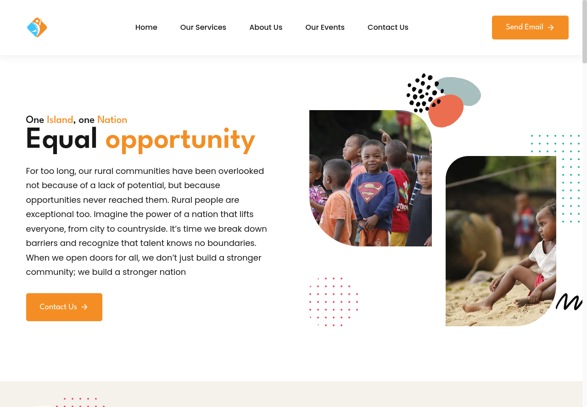

<div align="center">


  <h2 align="center">Wintogether - Wintogether Website</h2>

  Wintogether is a fully responsive Wintogether website, <br />Responsive for all devices, build using Vue, CSS, and JavaScript.

  <a href="https://wintogether-v2-gg15.vercel.app/"><strong>➥ Live Demo</strong></a>

</div>

<br />

### Demo Screeshots



### Prerequisites

Before you begin, ensure you have met the following requirements:

* [Git](https://git-scm.com/downloads "Download Git") must be installed on your operating system.

### Run Locally

To run **Wintogether** locally, run this command on your git bash:

Linux and macOS:

```bash
sudo git clone https://github.com/GitHubFabrino/WintogetherV2
```

Windows:

```bash
git clone https://github.com/GitHubFabrino/WintogetherV2
```

### Contact

If you want to contact with me you can reach me at [Linkedin](https://www.linkedin.com/in/pierret-fabrino-rakotoharilalaina-aa6152263/).

### License

This project is **free to use** and does not contains any license.
